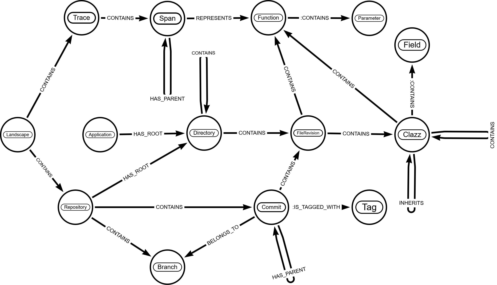

# persistence-service

This project uses Quarkus, the Supersonic Subatomic Java Framework.

If you want to learn more about Quarkus, please visit its website: <https://quarkus.io/>.

## Running the application in dev mode

You can run your application in dev mode that enables live coding using:

```shell script
./gradlew quarkusDev
```

> **_NOTE:_**  Quarkus now ships with a Dev UI, which is available in dev mode only at <http://localhost:8080/q/dev/>.

## Packaging and running the application

The application can be packaged using:

```shell script
./gradlew build
```

It produces the `quarkus-run.jar` file in the `build/quarkus-app/` directory.
Be aware that it’s not an _über-jar_ as the dependencies are copied into the `build/quarkus-app/lib/` directory.

The application is now runnable using `java -jar build/quarkus-app/quarkus-run.jar`.

If you want to build an _über-jar_, execute the following command:

```shell script
./gradlew build -Dquarkus.package.jar.type=uber-jar
```

The application, packaged as an _über-jar_, is now runnable using `java -jar build/*-runner.jar`.

## Creating a native executable

You can create a native executable using:

```shell script
./gradlew build -Dquarkus.native.enabled=true
```

Or, if you don't have GraalVM installed, you can run the native executable build in a container using:

```shell script
./gradlew build -Dquarkus.native.enabled=true -Dquarkus.native.container-build=true
```

You can then execute your native executable with: `./build/persistence-service-1.0.0-SNAPSHOT-runner`

If you want to learn more about building native executables, please consult <https://quarkus.io/guides/gradle-tooling>.

## Related Guides

- REST ([guide](https://quarkus.io/guides/rest)): A Jakarta REST implementation utilizing build time processing and Vert.x. This extension is not compatible with the quarkus-resteasy extension, or any of the extensions that depend on it.
- REST Jackson ([guide](https://quarkus.io/guides/rest#json-serialisation)): Jackson serialization support for Quarkus REST. This extension is not compatible with the quarkus-resteasy extension, or any of the extensions that depend on it

## Provided Code

### gRPC

Create your first gRPC service

[Related guide section...](https://quarkus.io/guides/grpc-getting-started)

### REST

Easily start your REST Web Services

[Related guide section...](https://quarkus.io/guides/getting-started-reactive#reactive-jax-rs-resources)

# Ab hier ist eigenes
### TODO: Mal schauen, was von der default übernommen werden kann

# Database Model



<table style="border-collapse: collapse; width: 100%;">
<tr>
<th style="border:1px solid #999; padding:6px;">Node Type</th>
<th style="border:1px solid #999; padding:6px;" colspan="2">Properties</th>
</tr>

<tr>
<td style="border:1px solid #999; padding:6px;" rowspan="2">Application</td>
<td style="border:1px solid #999; padding:6px;"><u>id</u></td>
<td style="border:1px solid #999; padding:6px;"><u>Long</u></td>
</tr>
<tr>
<td style="border:1px solid #999; padding:6px;">name</td>
<td style="border:1px solid #999; padding:6px;">string</td>
</tr>

<tr>
<td style="border:1px solid #999; padding:6px;" rowspan="2">Branch</td>
<td style="border:1px solid #999; padding:6px;"><u>id</u></td>
<td style="border:1px solid #999; padding:6px;"><u>Long</u></td>
</tr>
<tr>
<td style="border:1px solid #999; padding:6px;">name</td>
<td style="border:1px solid #999; padding:6px;">string</td>
</tr>

<tr>
<td style="border:1px solid #999; padding:6px;" rowspan="8">Clazz</td>
<td style="border:1px solid #999; padding:6px;"><u>id</u></td>
<td style="border:1px solid #999; padding:6px;"><u>Long</u></td>
</tr>
<tr>
<td style="border:1px solid #999; padding:6px;">name</td>
<td style="border:1px solid #999; padding:6px;">string</td>
</tr>
<tr>
<td style="border:1px solid #999; padding:6px;">type</td>
<td style="border:1px solid #999; padding:6px;">ClassType</td>
</tr>
<tr>
<td style="border:1px solid #999; padding:6px;">modifiers</td>
<td style="border:1px solid #999; padding:6px;">set[String]</td>
</tr>
<tr>
<td style="border:1px solid #999; padding:6px;">implementedInterfaces</td>
<td style="border:1px solid #999; padding:6px;">set[String]</td>
</tr>
<tr>
<td style="border:1px solid #999; padding:6px;">annotations</td>
<td style="border:1px solid #999; padding:6px;">set[String]</td>
</tr>
<tr>
<td style="border:1px solid #999; padding:6px;">enumValues</td>
<td style="border:1px solid #999; padding:6px;">set[String]</td>
</tr>
<tr>
<td style="border:1px solid #999; padding:6px;">metrics</td>
<td style="border:1px solid #999; padding:6px;">map[String, Double]</td>
</tr>

<tr>
<td style="border:1px solid #999; padding:6px;" rowspan="4">Commit</td>
<td style="border:1px solid #999; padding:6px;"><u>hash</u></td>
<td style="border:1px solid #999; padding:6px;"><u>string</u></td>
</tr>
<tr>
<td style="border:1px solid #999; padding:6px;">author</td>
<td style="border:1px solid #999; padding:6px;">string</td>
</tr>
<tr>
<td style="border:1px solid #999; padding:6px;">authorDate</td>
<td style="border:1px solid #999; padding:6px;">Instant</td>
</tr>
<tr>
<td style="border:1px solid #999; padding:6px;">commitDate</td>
<td style="border:1px solid #999; padding:6px;">Instant</td>
</tr>

<tr>
<td style="border:1px solid #999; padding:6px;" rowspan="2">Directory</td>
<td style="border:1px solid #999; padding:6px;"><u>id</u></td>
<td style="border:1px solid #999; padding:6px;"><u>Long</u></td>
</tr>
<tr>
<td style="border:1px solid #999; padding:6px;">name</td>
<td style="border:1px solid #999; padding:6px;">string</td>
</tr>

<tr>
<td style="border:1px solid #999; padding:6px;" rowspan="4">Field</td>
<td style="border:1px solid #999; padding:6px;"><u>id</u></td>
<td style="border:1px solid #999; padding:6px;"><u>Long</u></td>
</tr>
<tr>
<td style="border:1px solid #999; padding:6px;">name</td>
<td style="border:1px solid #999; padding:6px;">string</td>
</tr>
<tr>
<td style="border:1px solid #999; padding:6px;">type</td>
<td style="border:1px solid #999; padding:6px;">String</td>
</tr>
<tr>
<td style="border:1px solid #999; padding:6px;">modifiers</td>
<td style="border:1px solid #999; padding:6px;">list[String]</td>
</tr>

<tr>
<td style="border:1px solid #999; padding:6px;" rowspan="12">FileRevision</td>
<td style="border:1px solid #999; padding:6px;"><u>id</u></td>
<td style="border:1px solid #999; padding:6px;"><u>Long</u></td>
</tr>
<tr>
<td style="border:1px solid #999; padding:6px;">hash</td>
<td style="border:1px solid #999; padding:6px;">string</td>
</tr>
<tr>
<td style="border:1px solid #999; padding:6px;">name</td>
<td style="border:1px solid #999; padding:6px;">string</td>
</tr>
<tr>
<td style="border:1px solid #999; padding:6px;">hasFileData</td>
<td style="border:1px solid #999; padding:6px;">boolean</td>
</tr>
<tr>
<td style="border:1px solid #999; padding:6px;">language</td>
<td style="border:1px solid #999; padding:6px;">Language</td>
</tr>
<tr>
<td style="border:1px solid #999; padding:6px;">packageName</td>
<td style="border:1px solid #999; padding:6px;">String</td>
</tr>
<tr>
<td style="border:1px solid #999; padding:6px;">importNames</td>
<td style="border:1px solid #999; padding:6px;">set[String]</td>
</tr>
<tr>
<td style="border:1px solid #999; padding:6px;">metrics</td>
<td style="border:1px solid #999; padding:6px;">map[String, Double]</td>
</tr>
<tr>
<td style="border:1px solid #999; padding:6px;">lastEditor</td>
<td style="border:1px solid #999; padding:6px;">String</td>
</tr>
<tr>
<td style="border:1px solid #999; padding:6px;">addedLines</td>
<td style="border:1px solid #999; padding:6px;">int</td>
</tr>
<tr>
<td style="border:1px solid #999; padding:6px;">modifiedLines</td>
<td style="border:1px solid #999; padding:6px;">int</td>
</tr>
<tr>
<td style="border:1px solid #999; padding:6px;">deletedLines</td>
<td style="border:1px solid #999; padding:6px;">int</td>
</tr>

<tr>
<td style="border:1px solid #999; padding:6px;" rowspan="10">Function</td>
<td style="border:1px solid #999; padding:6px;"><u>id</u></td>
<td style="border:1px solid #999; padding:6px;"><u>Long</u></td>
</tr>
<tr>
<td style="border:1px solid #999; padding:6px;">name</td>
<td style="border:1px solid #999; padding:6px;">string</td>
</tr>
<tr>
<td style="border:1px solid #999; padding:6px;">returnType</td>
<td style="border:1px solid #999; padding:6px;">String</td>
</tr>
<tr>
<td style="border:1px solid #999; padding:6px;">isConstructor</td>
<td style="border:1px solid #999; padding:6px;">boolean</td>
</tr>
<tr>
<td style="border:1px solid #999; padding:6px;">annotations</td>
<td style="border:1px solid #999; padding:6px;">set[String]</td>
</tr>
<tr>
<td style="border:1px solid #999; padding:6px;">modifiers</td>
<td style="border:1px solid #999; padding:6px;">set[String]</td>
</tr>
<tr>
<td style="border:1px solid #999; padding:6px;">outgoingMethodCalls</td>
<td style="border:1px solid #999; padding:6px;">set[String]</td>
</tr>
<tr>
<td style="border:1px solid #999; padding:6px;">metrics</td>
<td style="border:1px solid #999; padding:6px;">map[String, Double]</td>
</tr>
<tr>
<td style="border:1px solid #999; padding:6px;">startLine</td>
<td style="border:1px solid #999; padding:6px;">int</td>
</tr>
<tr>
<td style="border:1px solid #999; padding:6px;">endLine</td>
<td style="border:1px solid #999; padding:6px;">int</td>
</tr>

<tr>
<td style="border:1px solid #999; padding:6px;" rowspan="1">Landscape</td>
<td style="border:1px solid #999; padding:6px;"><u>tokenId</u></td>
<td style="border:1px solid #999; padding:6px;"><u>string</u></td>
</tr>

<tr>
<td style="border:1px solid #999; padding:6px;" rowspan="4">Parameter</td>
<td style="border:1px solid #999; padding:6px;"><u>id</u></td>
<td style="border:1px solid #999; padding:6px;"><u>Long</u></td>
</tr>
<tr>
<td style="border:1px solid #999; padding:6px;">name</td>
<td style="border:1px solid #999; padding:6px;">string</td>
</tr>
<tr>
<td style="border:1px solid #999; padding:6px;">type</td>
<td style="border:1px solid #999; padding:6px;">String</td>
</tr>
<tr>
<td style="border:1px solid #999; padding:6px;">modifiers</td>
<td style="border:1px solid #999; padding:6px;">list[String]</td>
</tr>

<tr>
<td style="border:1px solid #999; padding:6px;" rowspan="2">Repository</td>
<td style="border:1px solid #999; padding:6px;"><u>id</u></td>
<td style="border:1px solid #999; padding:6px;"><u>Long</u></td>
</tr>
<tr>
<td style="border:1px solid #999; padding:6px;">name</td>
<td style="border:1px solid #999; padding:6px;">string</td>
</tr>

<tr>
<td style="border:1px solid #999; padding:6px;" rowspan="3">Span</td>
<td style="border:1px solid #999; padding:6px;"><u>spanId</u></td>
<td style="border:1px solid #999; padding:6px;"><u>string</u></td>
</tr>
<tr>
<td style="border:1px solid #999; padding:6px;">start_time</td>
<td style="border:1px solid #999; padding:6px;">long</td>
</tr>
<tr>
<td style="border:1px solid #999; padding:6px;">end_time</td>
<td style="border:1px solid #999; padding:6px;">long</td>
</tr>

<tr>
<td style="border:1px solid #999; padding:6px;" rowspan="1">Tag</td>
<td style="border:1px solid #999; padding:6px;"><u>name</u></td>
<td style="border:1px solid #999; padding:6px;"><u>string</u></td>
</tr>

<tr>
<td style="border:1px solid #999; padding:6px;" rowspan="3">Trace</td>
<td style="border:1px solid #999; padding:6px;"><u>traceId</u></td>
<td style="border:1px solid #999; padding:6px;"><u>string</u></td>
</tr>
<tr>
<td style="border:1px solid #999; padding:6px;">start_time</td>
<td style="border:1px solid #999; padding:6px;">long</td>
</tr>
<tr>
<td style="border:1px solid #999; padding:6px;">end_time</td>
<td style="border:1px solid #999; padding:6px;">long</td>
</tr>
</table>

# Development

## Code Style
We recommend to use the IntelliJ IDEA IDE.    
To not get into checkstyle problems, we also recommend to use the ```google-java-format``` plugin.

Follow these steps to use it:
1. Under `File -> Settings -> Plugins -> Marketplace` search for `google-java-format`
2. Install the plugin and press the `Restart IDE` button
3. Under `File -> Settings -> google-java-format Settings` check `Enable google-java-format`
   (The value of `Code style` should be set to `Default Google Java style`)
4. Under `Help -> Edit Custom VM Options...` add the following lines from the [documentation](https://github.com/google/google-java-format/blob/master/README.md#intellij-jre-config):
```
--add-exports=jdk.compiler/com.sun.tools.javac.api=ALL-UNNAMED
--add-exports=jdk.compiler/com.sun.tools.javac.code=ALL-UNNAMED
--add-exports=jdk.compiler/com.sun.tools.javac.file=ALL-UNNAMED
--add-exports=jdk.compiler/com.sun.tools.javac.parser=ALL-UNNAMED
--add-exports=jdk.compiler/com.sun.tools.javac.tree=ALL-UNNAMED
--add-exports=jdk.compiler/com.sun.tools.javac.util=ALL-UNNAMED
```
5. Restart the IDE

Pressing `CTRL + ALT + L` (default auto-format configuration of IntelliJ IDEA) should now reformat the code using the google java style guide.
